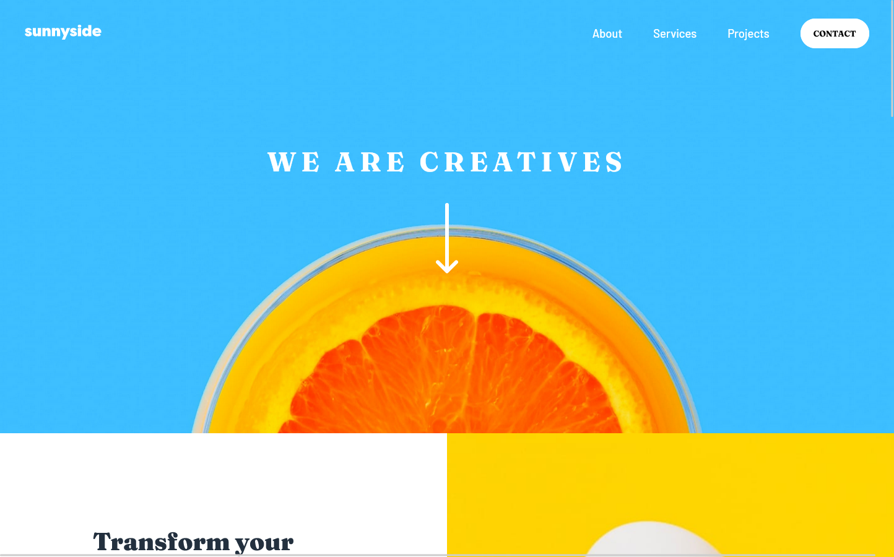

# Frontend Mentor - Sunnyside agency landing page solution

This is a solution to the [Sunnyside agency landing page challenge on Frontend Mentor](https://www.frontendmentor.io/challenges/sunnyside-agency-landing-page-7yVs3B6ef). Frontend Mentor challenges help you improve your coding skills by building realistic projects.

## Table of contents

- [Overview](#overview)
  - [The challenge](#the-challenge)
  - [Screenshot](#screenshot)
  - [Links](#links)
- [My process](#my-process)
  - [Built with](#built-with)
  - [What I learned](#what-i-learned)
  - [Continued development](#continued-development)
  - [Useful resources](#useful-resources)
- [Author](#author)

**Note: Delete this note and update the table of contents based on what sections you keep.**

## Overview

### The challenge

Users should be able to:

- View the optimal layout for the site depending on their device's screen size
- See hover states for all interactive elements on the page

### Screenshot

)
)
)

### Links

- Solution URL: [Github](https://github.com/marijahavaic/fm-sunnyside-agency-landing-page)
- Live Site URL: [Github Pages](https://marijahavaic.github.io/fm-sunnyside-agency-landing-page/)

## My process

### Built with

- Semantic HTML5 markup
- CSS custom properties
- Flexbox
- Font Awesome Icons
- Mobile-first workflow
- Vanilla Javascript 

### What I learned

- I modified a Codepen to create the highlight from the designs. 


```html
<strong>Learn more</strong>
```

```css
strong {
    position: relative;
}

.brand strong::before {
    /* Highlight color */
    font-family: "Fraunces", sans-serif;
    background-color: var(--primary-yellow);
    opacity: 0.2;
    content: "";
    position: absolute;
    width: calc(100% + 14px);
    height: 50%;
    left: -4px;
    bottom: -4px;
    z-index: -1;
    border-radius: 3px;
}
```

- how to create a triangle with CSS


### Continued development

- Responsiveness


### Useful resources

- [Triangle - In French](https://outils-css.aliasdmc.fr/generateur-de-triangles-css.php) - This helped create the triangle for the mobile dropdown
- [Highlight Codepen](https://codepen.io/alvarotrigo/pen/oNpvMbb) - This is a Codepen I used to crate the highlighting

## Author

- Website - [Marija Havaic](https://marijahavaic.com)
- Frontend Mentor - [@marijahavaic](https://www.frontendmentor.io/profile/marijahavaic)
